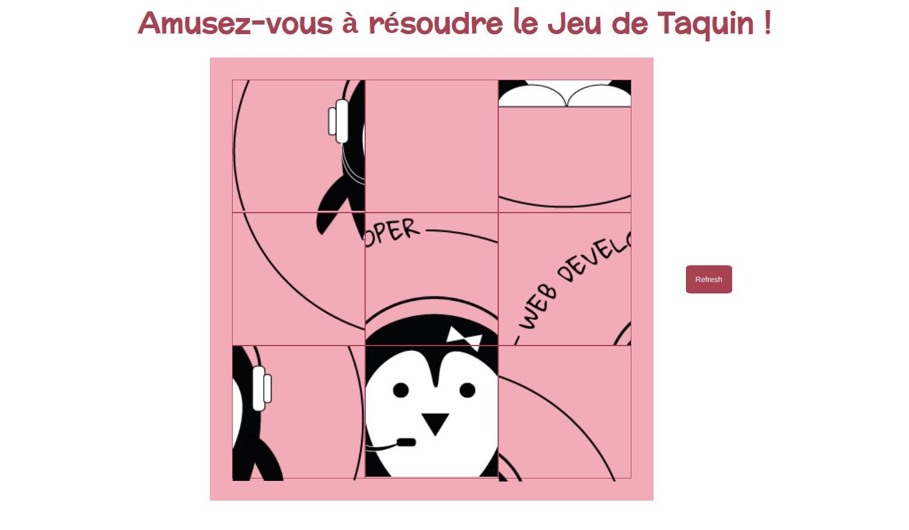

# Slide Puzzle Game JS.

This repository contains a slide puzzle created with JS. The graphical interface was created using HTML and CSS.

The game is based on the popular "slide puzzle", where players must rearrange the pieces of a split image on a board, sliding the pieces one by one to complete the image. Players can click on a piece adjacent to an empty piece to slide it. Pieces can only be moved if they are adjacent to the empty position, maintaining the logic of the puzzle.

## Features:

The images are randomly generated by reloading the page or clicking the Refresh button. To ensure the correct functioning of the puzzle, an algorithm was created to calculate whether the puzzle can be solved or not, always showing a puzzle that can be solved.

## ScreenShots:

### Game start

### Game end

## Links

If you want to have fun trying to solve the puzzle, follow this link: https://martasanzflores.github.io/Slide-puzzle-game-JS/
